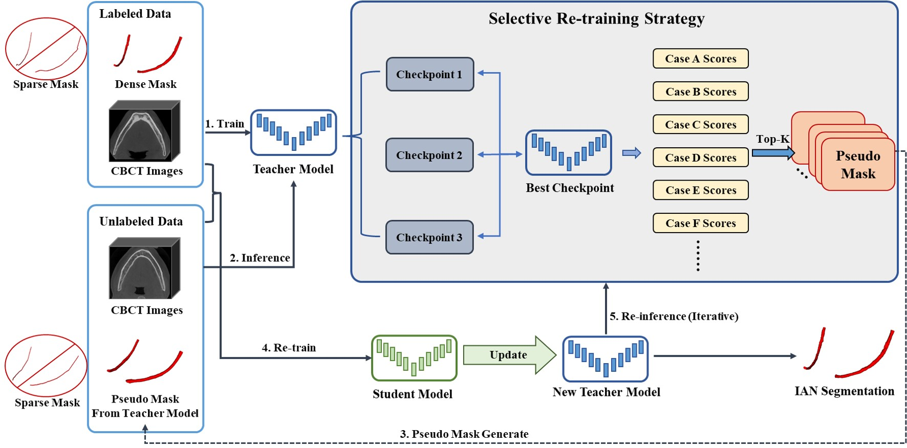

# SSL-IAN-Retraining for MICCAI FAIRY2023 Challenge
Champion Solution of [MICCAI FAIRY2023 Challenge](https://toothfairy.grand-challenge.org/) based on Self-training with Selective Re-training.

**Inferior Alveolar Nerve Segmentation in CBCT images using Connectivity-Based Selective Re-training**  
_Yusheng Liu(lys_sjtu@sjtu.edu.cn), Rui Xin(xr1999@sjtu.edu.cn), Tao Yang(yangtao22@sjtu.edu.cn) and Lisheng Wang(lswang@sjtu.edu.cn)_

Institute of Image Processing and Pattern Recognition, Department of Automation,  
Shanghai Jiao Tong University, Shanghai 200240, People’s Republic of China  

The pipeline of the proposed segmentation framework is shown in Figure below.  
We adopt nnUNet as the basic network models for IAN segmentation.   
Self-training method is adopted for semi-supervised semantic segmentation.  
In addition, a connectivity-based selective re-training strategy is designed to screen more plausible pseudo-labels.  



## Environments and Requirements:
### 1. nnUNet Configuration
Install nnU-Net as below.
You should meet the requirements of nnUNet, our method does not need any additional requirements.  
For more details, please refer to https://github.com/MIC-DKFZ/nnUNet  
```
git clone https://github.com/MIC-DKFZ/nnUNet.git
cd nnUNet
pip install -e .
```
### 2. Pipeline of the Proposed Framework
#### 2.1. Dataset Load and Reconstruction
Load ToothFairy Dataset from https://ditto.ing.unimore.it/toothfairy/
```
python process/data_read.py
├── img
├── DenseMask
└── SparseMask
```
Filter out densely-labeled data with more than 2 connected domains.  
```
python process/Check_Component.py
```
Filter out the data with DSC lower than 0.85 (if you have trained the model using original dataset and have the weight) , and only select the data with definite boundaries.
```
python process/select_fineGT_series.py
```
